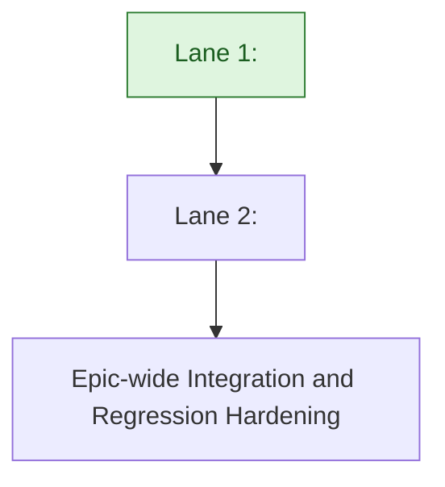

# <Epic Name> - High-Level Development Plan

Last updated: <YYYY-MM-DD>

Context references:
- Epic overview: `<path>`
- Epic informal source: `<path>`
- Epic PRD/EDD/FDD, when present: `<path>`
- Feature tracks:
  - `<feature_slug>/informal.md`
  - `<feature_slug>/prd.md`
  - `<feature_slug>/fdd.md`
  - `<feature_slug>/plan.md`
- Lane-structured reference format, when useful: `<path>`

## Why We Are Organizing By Lanes

Lanes group related features so implementation can proceed in coherent streams with clearer ownership boundaries, lower context switching, and explicit dependency sequencing. A lane is usually the work boundary for one engineer or tightly coordinated owner, with features inside the lane worked serially unless noted otherwise.

## Lane Summary

- Lane 1: <Lane Name>
  - <One-sentence summary of what this lane delivers.>
- Lane 2: <Lane Name>
  - <One-sentence summary of what this lane delivers.>

## Clarifications and Assumptions

- This plan is intentionally high-level and lane-oriented.
- Source scope comes from `<source path>`.
- Serial order inside each lane is dependency-first, then risk reduction, then workflow completion.
- Lane dependencies are lane-level by default; ticket-level constraints are called out when needed.

## Lane 1: <Lane Name>

### Scope

- `<Ticket or Feature>` <Title>
- `<Ticket or Feature>` <Title>
- Feature docs:
  - `<feature_slug>/informal.md`
  - `<feature_slug>/prd.md`
  - `<feature_slug>/fdd.md`

### Proposed Serial Order

1. `<Ticket or Feature>` <Title>
2. `<Ticket or Feature>` <Title>

### Dependency Notes

- <Why items in this lane are ordered this way.>
- <Important ticket-level or feature-level constraints.>

### Cross-Lane Dependencies

- No inbound lane dependency; this lane can start immediately.
- Lane <N> depends on completion of this lane.

## Lane 2: <Lane Name>

### Scope

- `<Ticket or Feature>` <Title>

### Proposed Serial Order

1. `<Ticket or Feature>` <Title>

### Dependency Notes

- <Why items in this lane are ordered this way.>

### Cross-Lane Dependencies

- Hard dependency on completion of Lane 1.

## Suggested Global Execution Shape

1. Start Lane 1 (<Lane Name>) first.
2. After Lane 1 completes, start Lane 2 (<Lane Name>).
3. Run epic-wide integration and regression hardening after all functional lanes complete.

## Lane Dependency Flow (Mermaid)

Note: Light green lane nodes indicate lanes with no inbound dependencies and can be started immediately.

## Open Questions

- ...

## Decision Log

### <YYYY-MM-DD> - <Decision>
- Change: <What changed in the lane plan.>
- Reason: <Why.>
- Evidence: `<source path>`
- Impact: <Effect on sequencing, ownership boundaries, or follow-up work.>

## Recommended Next Work

Name the next lane or feature to document and the appropriate follow-up Harness skill.
